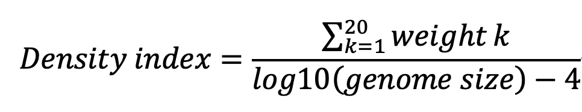

# NCLDV_Screening
NCLDV_Screening is a jupyter based pipeline to screen the possible NCLDVs from raw bins generated by binning tools, such as Metabat2.
Initially, this work is inspired by a work [Subramaniam et. al., 2020](https://pubmed.ncbi.nlm.nih.gov/31937645/), where a correlation pattern was observed between the genome size and the number of core genes.  
Therefore, we utilized a core gene density index for screening potential giant viruses.  
In brief, we selected 20 marker genes of Nucleo-Cytoplasmic Virus Orthologous Groups (NCVOGs), which are universal or nearly universal present across all known giant virus families. Then we assigned weights to 20 NCVOGs according to conservation levels across families

## Verification and Output
We used a reference dataset, including Archaea, Bacteria and Eukaryota genomes, as well as a NCLDV reference dataset to assess whether this work is effective.  
From the plot,  
  
a clear seperation between NCLDV and cellular genomes was observed. y-axis is the sum of weights of 20 NCVOGs and x-axis is the log10(genome size).

So then we calculate the Density index based on this plot, and find that a cut-off of 5.75 of Density index is fine to get reliable NCLDV bins.  
  

Using the pipeline provided, the value of density index could be automatically generated.  
Running the script using the provided "test_bins" should generate the same output in "test_output".  
  
You can see metabat2_bin_1, metabat2_bin_6, metabat2_bin_13, metabat2_bin_1 are potential NCLDV bins.

## Dependencies
The pipeline is written in Python v3.9.16.
The pipeline requires Prodigal and HMMER3 for gene call and HMM searches.

## Citation
Fang, Yue, et al. "Genome-resolved year-round dynamics reveal a broad range of giant virus microdiversity." bioRxiv (2024). [link](https://www.biorxiv.org/content/10.1101/2024.07.08.602415v1)

## Contact
lingjie@kuicr.kyoto-u.ac.jp

